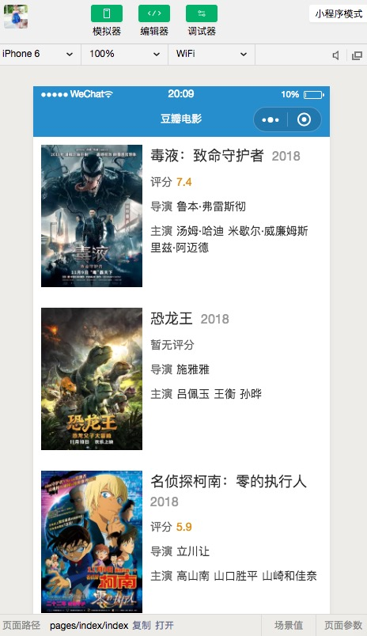
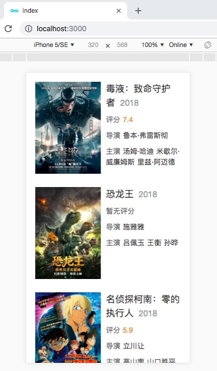
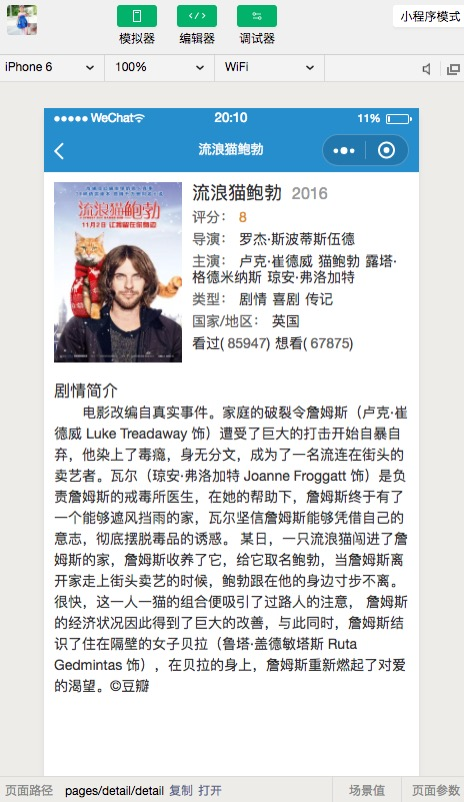
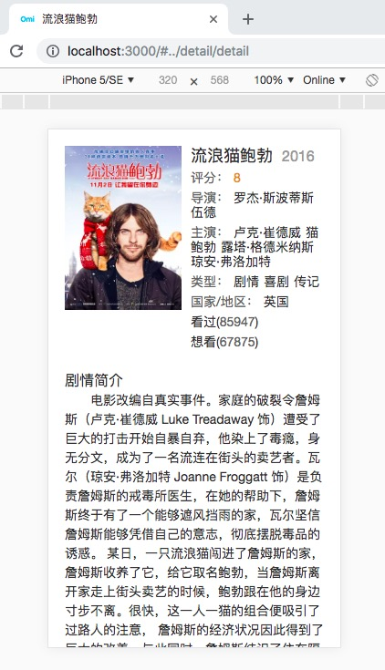

# omi-mp - 微信小程序开发和生成 Web

> 通过微信小程序开发和一键生成 Web 的 H5 SPA (基于 omi + [omi-router](https://github.com/Tencent/omi/tree/master/packages/omi-router))

看下官方模板的转换例子：


因为 Web 里拉取不到用户登录态，更换了用户头像和名称。

再看下豆瓣 DEMO 转换的例子:

| **小程序**                         | **Web SPA**                           |
| ------------------------------- | ----------------------------------- |
|| |
|||

你可以[在这里找](https://github.com/Tencent/omi/tree/master/packages/omi-mp-douban)到这个豆瓣小程序。

# 快速体验

把小程序项目拷贝到 src-mp 目录，如果是新的小程序，可以在 src-mp 目录创建小程序，目录要求：

目录说明:

```
├─ components     //存放所有组件，每个组件一个文件夹，暂不支持乱放
├─ pages          //存放所有页面，每个页面一个文件夹，暂不支持乱放
│  ├─ index    
│  └─ logs   
├─ utils
├─ app.js
├─ app.json
├─ app.wxss
├─ project.config.json
```

请严格按照上面目录约定，然后就可以使用小程序开发或生产 Web 了:

```bash
npm start  //开发
npm build  //发布
```

# 原理

## WXML 编译

举个99乘法表的例子:

```js
compile(`
<view wx:for="{{[1, 2, 3, 4, 5, 6, 7, 8, 9]}}" wx:for-item="i">
  <view wx:for="{{[1, 2, 3, 4, 5, 6, 7, 8, 9]}}" wx:for-item="j">
    <view wx:if="{{i <= j}}">
      {{i}} * {{j}} = {{i * j}}
    </view>
  </view>
</view>`)
```

编译之后：

```js
function render() {
  return (
    h('div', {}, [1, 2, 3, 4, 5, 6, 7, 8, 9].map((i, index) => {
      h('div', {}, [1, 2, 3, 4, 5, 6, 7, 8, 9].map((j, index) => {
        i <= j && h('div', {}, [`${i} * ${j} = ${i * j}`])
      }))
    }))
  )
}
```

Wxml 会被编译成 hyperscript，并且对应的标签会被[转换成 HTML 标签](https://github.com/Tencent/omi/blob/master/packages/omi-mp/scripts/mp/tag-mapping.js#L1-L17)。

## WXSS 编译

编译前：

```css
view image .image{
  color: red;
}
```

编译后:

```css
div img .image{
  color: red;
}
```

不仅仅标签会进行替换，rpx 也会在运行时替换成 px。

## 小程序生命周期

### 页面生命周期函数

| 名称 | 描述  |
| ------ | ------  |
| onLoad | 	监听页面加载,对应 Omi installed	  |
| onShow | 监听页面显示	  |
| onReady | 监听页面初次渲染完成 ,对应 Omi installed	 |
| onHide | 监听页面隐藏	  |
| onUnload | 监听页面卸载  ,对应 Omi uninstall	|

### 组件生命周期函数

| 名称 | 描述  |
| ------ | ------  |
| created | 	在组件实例进入页面节点树时执行，注意此时不能调用 setData	,对应 Omi install   |
| attached | 在组件实例进入页面节点树时执行	,对应 Omi installed   |
| ready | 在组件布局完成后执行，此时可以获取节点信息（使用 SelectorQuery ）	,对应 Omi installed  |
| moved | 在组件实例被移动到节点树另一个位置时执行	  |
| detached | 在组件实例被从页面节点树移除时执行 ,对应 Omi uninstall |

## 注意

目前不支持 template 标签，欢迎试用反馈或 PR。

## License
MIT [@dntzhang](https://github.com/dntzhang)
