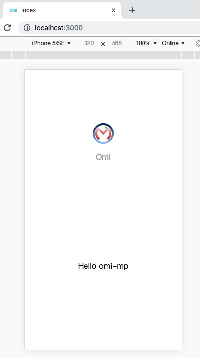

# omi-mp - 微信小程序开发 Web




# 原理

目前除了 template，其余基本都支持，不支持的欢迎反馈或 PR。

举个99乘法表的例子:

```js
compile(`
<view wx:for="{{[1, 2, 3, 4, 5, 6, 7, 8, 9]}}" wx:for-item="i">
  <view wx:for="{{[1, 2, 3, 4, 5, 6, 7, 8, 9]}}" wx:for-item="j">
    <view wx:if="{{i <= j}}">
      {{i}} * {{j}} = {{i * j}}
    </view>
  </view>
</view>`)
```

编译之后：

```js
function render() {
  return (
    h('view', {}, [1, 2, 3, 4, 5, 6, 7, 8, 9].map((i, index) => {
      h('view', {}, [1, 2, 3, 4, 5, 6, 7, 8, 9].map((j, index) => {
        i <= j && h('view', {}, [`${i} * ${j} = ${i * j}`])
      }))
    }))
  )
}
```

## 小程序生命周期

### 页面生命周期函数

| 名称 | 描述  |
| ------ | ------  |
| onLoad | 	监听页面加载,对应 Omi installed	  |
| onShow | 监听页面显示	  |
| onReady | 监听页面初次渲染完成 ,对应 Omi installed	 |
| onHide | 监听页面隐藏	  |
| onUnload | 监听页面卸载  ,对应 Omi uninstall	|

### 组件生命周期函数

| 名称 | 描述  |
| ------ | ------  |
| created | 	在组件实例进入页面节点树时执行，注意此时不能调用 setData	,对应 Omi install   |
| attached | 在组件实例进入页面节点树时执行	,对应 Omi installed   |
| ready | 在组件布局完成后执行，此时可以获取节点信息（使用 SelectorQuery ）	,对应 Omi installed  |
| moved | 在组件实例被移动到节点树另一个位置时执行	  |
| detached | 在组件实例被从页面节点树移除时执行 ,对应 Omi uninstall |

## License
MIT [@dntzhang](https://github.com/dntzhang)
