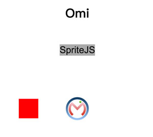

# omi-spritejs

> Perfect fusion of web components, jsx and canvas.

The current version is v0.0.0. v1.0.0 is coming soon.

```js
import { render, define, WeElement } from 'omi'
import '../../src/index'
import omiUrl from './omi.jpg'

define('my-app', class extends WeElement {
  static observe = true

  data = {
    scale: 0.5
  }

  css() {
    return `
        div{
          width: 400px;
          height: 400px;
          text-align: center;
        }
        sprite.block{
          width: 50px;
          height: 50px;
          background-color: red;
          --sprite-x: 50;
          --sprite-y: 200px;
          --sprite-anchor: 0, 0.5;
        }`
  }

  onClick = (evt) => {
    // console.log(evt)
    this.data.scale = 0.5 + Math.random() * 0.1
  }

  render() {
    return (
      <div>
        <h1>Omi</h1>
        <omi-spritejs viewport={[400, 400]}>
          <layer id="fglayer">
            <group>
              <sprite class="block"></sprite>
              <sprite x={200} y={200} anchor={[0.5, 0.5]} textures={omiUrl}
                scale={this.data.scale}
                onClick={this.onClick}
              ></sprite>
            </group>
          </layer>
        </omi-spritejs>
      </div>
    )
  }
})

render(<my-app />, 'body')
```

The effect shown below:



## License

MIT © [akira-cn](https://github.com/akira-cn/)
