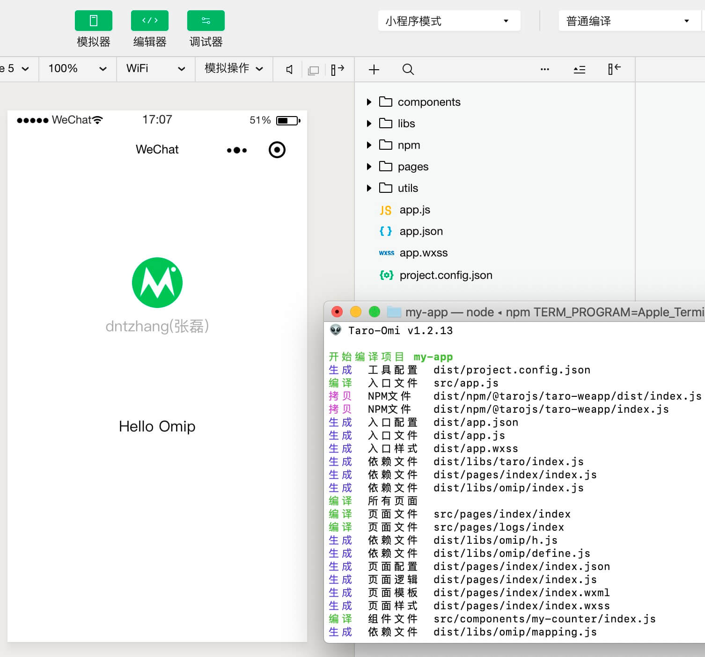

# Omip

使用 Omi 开发小程序

> 现在，Omi 不仅仅可以开发桌面 Web、移动 H5，还可以直接开发小程序！

* Write Once, Run Anywhere
* Learn Once, Write Anywhere



## Omip 特性

* 一次学习，多处开发，一次开发，多处运行
* 使用 JSX，表达能力和编程体验大于模板
* 支持使用 npm/yarn 安装管理第三方依赖
* 支持使用 ES6+
* 支持使用 CSS 预编译器
* 小程序 API 优化，异步 API Promise 化
* 超轻量的依赖包，顺从小程序标签和组件的设计

## 快速开始

```js
npm i omi-cli -g
omi init-p my-app
cd my-app
npm start
```
> node 版本要求 >= 8

> 也支持一条命令 `npx omi-cli init-p my-app` (npm v5.2.0+)

把小程序目录设置到 dist 目录就可以愉快地调试了！

## 代码示例

```js
import { WeElement, define } from 'omi'
import './index.css'

define('page-counter', class extends WeElement {
  config = {
    navigationBarTitleText: 'Counter'
  }

  data = {
    count: 1
  }

  sub = () => {
    this.data.count--
    this.update()
  }

  add = () => {
    this.data.count++
    this.update()
  }

  render() {
    return (
      <view>
        <button onClick={this.sub}>-</button>
        <text>{this.data.count}</text>
        <button onClick={this.add}>+</button>
      </view>
    )
  }
})
```

## 实战案例


## License

MIT © dntzhang

#### Open Source Software Licensed Under the MIT License:

[tarojs](https://github.com/NervJS/taro) 1.2.13
Copyright (c) 2019 O2Team
