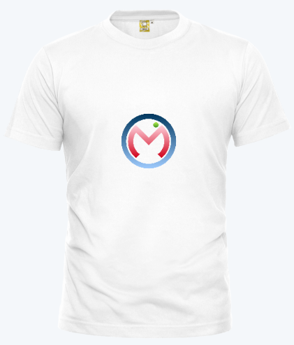
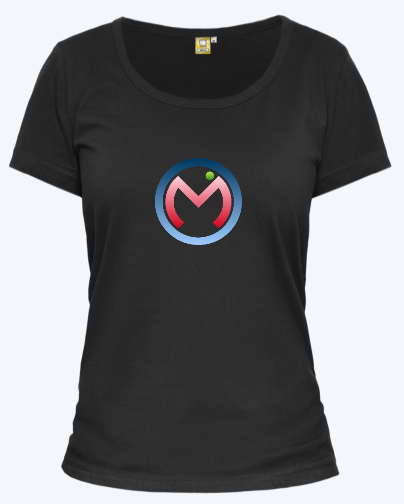
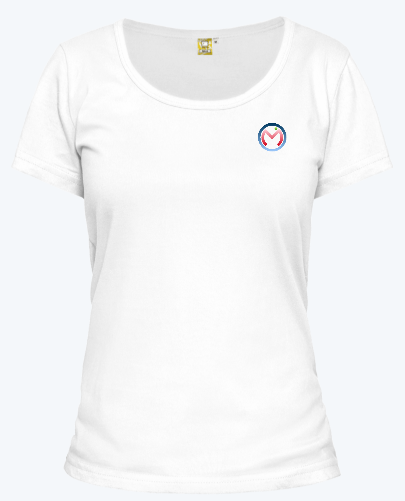

## Tencent Omi 생태계 배포

Omi 4.0이 배포된후 지금까지 많은 의견, 제의 및 진지한 PR들을 받았습니다. 비록 지금까지는 모두 외국인분들이었지만, IE의 시장 점유율이 점점 감소하고 미래가 가까워짐에 따라 중국인들도 점점 Omi 받아들일것입니다. Omi 팀은 한주간 작업을했고 마침내 핵심 생태계를 만들었습니다. 이 생태계는 많은 개발자를 지원하는데 사용될 것입니다. 물론 이제 막 시작일 뿐이며 저희는 여러분들의 어떤 요청사항도 환영합니다. 그리고 [Issues](https://github.com/Tencent/omi/issues/new) 에 이슈를 등록해 주시면 빠르게 해결할 것입니다. 아래는 저희가 최근 한주간 작업한 사항에 대한 소개입니다:


| **프로젝트**                         | **설명**                           |
| ------------------------------- | ----------------------------------- |
| [omi-docs](https://github.com/Tencent/omi/blob/master/docs/main-concepts.cn.md)| Omi 공식문서 |
| [omi-devtools](https://github.com/f/omi-devtools)| 크롬 개발자 도구 |
| [omi-cli](https://github.com/Tencent/omi/tree/master/packages/omi-cli)| Javascript 와 Typescript Scaffolding 지원 |
|[omi-i18n](https://github.com/i18next/omi-i18n)| Omi 다국어 해결 방안 |
| [omi-transform](https://github.com/Tencent/omi/tree/master/packages/omi-transform)|Omi 와 [css3transform](https://tencent.github.io/omi/packages/omi-transform/css3transform/)는 궁합이 잘 맞습니다. 당신의 Omi 프로젝트에서 쉽게 CSS3 transform을 할 수 있습니다.|
| [omi-page](https://github.com/Tencent/omi/tree/master/packages/omi-page) | [page.js](https://github.com/visionmedia/page.js) 기반의 Omi 라우팅 |
| [omi-tap](https://github.com/Tencent/omi/tree/master/packages/omi-tap)| Omi 프로젝트의 간단한 tap 지원 |
| [omi-finger](https://github.com/Tencent/omi/tree/master/packages/omi-finger)| Omi 터치 라이브러리 |
| [omi-mobx](https://github.com/Tencent/omi/tree/master/packages/omi-mobx)| Omi Mobx 어댑터 |
|[omi element ui(working)](https://github.com/Tencent/omi/tree/master/packages/omi-element-ui)| Omi 버전의 element-ui |
|[westore](https://github.com/dntzhang/westore)| 미니프로그램 솔루션 westore 와 Omi 콜라보레이션 |
| omi 기타 | 티셔츠, 옷, 휴대폰 케이스, 가방 등 |

## 문서 다국어

현재 세 가지 언어 버전의 개발 문서가 있습니다.

| **언어**    | **Quick Start**                       |**주요개념**  |
|  -----   |  -----                    | -----   |
| 영어        | [English](https://github.com/Tencent/omi/blob/master/README.md)             |[English](https://github.com/Tencent/omi/blob/master/docs/main-concepts.md)  |
| 중국어-간체        | [简体中文](https://github.com/Tencent/omi/blob/master/README.CN.md)             |[简体中文](https://github.com/Tencent/omi/blob/master/docs/main-concepts.cn.md)  |
| 한국어        | [한국어](https://github.com/Tencent/omi/blob/master/README.KR.md)                     |[한국어](https://github.com/Tencent/omi/blob/master/docs/main-concepts.kr.md)  |

터키어와 일본어의 문서도 곧 제공될 예정입니다.

## 개발자 도구

Omi 개발자 도구를 사용해서 간다하게 디버그와 UI를 관리할 수 있습니다. 어떤 설정도 필요 없습니다. 설치후 바로 사용하면 됩니다.

Omi가 Web Components 와 Shadow-DOM 하기 떄문에 React 와 Vue 처럼 기타 엘리먼트 패널을 설치할 필요 없습니다. 크롬의 자체의 Elements 사이드 탭만 사용하면 됩니다. React 와 Vue의 개발자 도구만큼 강력합니다.


개발자 도구는 [터키 개발자 F](https://github.com/f) 에 의해 개발되었습니다. [크롬 응용프로그램](https://chrome.google.com/webstore/detail/omijs-devtools/pjgglfliglbhpcpalbpeloghnbceocmd/related) 에서 설치후 사용하면 됩니다.

## omi-cli

### 설치

```bash
$ npm i omi-cli -g               # install cli
$ omi init your_project_name     # init project, you can also exec 'omi init' in an empty folder
$ cd your_project_name           # please ignore this command if you executed 'omi init' in an empty folder
$ npm start                      # develop
$ npm run build                  # release
```

디렉토리 소개:

```
├─ config
├─ public
├─ scripts
├─ src
│  ├─ assets
│  ├─ elements    // 모든 custom elements 저장
│  ├─ store       // 모든 페이지의 store 저장
│  ├─ admin.js    // 해당파일 admin.html 로 빌드
│  └─ index.js    // 해당파일 index.html 로 빌드
```

TypeScript 템플릿 사용 (omi-cli v3.0.3+):

```bash
$ npm i omi-cli -g                  # install cli
$ omi init-ts your_project_name     # init project, you can also exec 'omi init-ts' in an empty folder
$ cd your_project_name              # please ignore this command if you executed 'omi init' in an empty folder
$ npm start                         # develop
$ npm run build                     # release
```

Cli 로 생성된 Scatffolding 프로젝트는 단일페이지 기반으로한 create-react-app 를 여러 페이지로 변환합니다. 설정 부분은 [create-react-app 사용자 가이드](https://github.com/facebook/create-react-app/blob/master/packages/react-scripts/template/README.md) 에서 확인 가능합니다.

omi-cli 에 기여해주신 [xcatliu](https://github.com/xcatliu) [uxu](https://github.com/pasturn) 두분 감사합니다.

## omi-i18n

`omi-i18n` 를 통해 다국어 프로젝트를 신속하게 개발할 수 있습니다:

```js
import { tag, WeElement } from "omi";
import { t } from "omi-i18n";

const catalog = {
  welcome: "Welcome to {{name}} using omi-i18n"
};

@tag("my-app")
class MyApp extends WeElement {
  render(props, data) {
    return (
      <i18n-provider locale="en" catalog={catalog}>
        <p slot="loading">
          <spinner-element />
        </p>
        <h1 class="app-title">{t("welcome", { name: data.name })}</h1>
      </i18n-provider>
    );
  }
}
```

## omi-transform

만약 당신이 [css3transform](https://tencent.github.io/omi/packages/omi-transform/css3transform/) 를 사용해보시면 페이지를 만드는것이 얼마나 간단한지 알수 있게 될 것입니다. 현재 Omi 프로젝트에서 css3transform의 뛰어난 기능 사용을 하며 고성능을 유지할 수 있습니다:

```js
import { render, WeElement, tag, observe } from "omi";
import "omi-transform";

@observe
@tag("my-app")
class MyApp extends WeElement {
  install() {
    this.data.rotateZ = 30
    this.linkRef = (e) => {
      this.animDiv = e
    }
  }


  installed() {
    setInterval(() => {
      // 느립니다. 왜냐하면 data가 update -> render -> diff -> apply diff 순으로 트리거 되기 떄문입니다.
      // this.data.rotateZ += 2

      // 빠릅니다. 왜냐하면 dom 을 직접 조작하기 때문입니다.
      this.animDiv.rotateZ += 2
      // Synchronous transform 은 update를 방지하기 위해 data 를 제공합니다.
      this.data.rotateZ = this.animDiv.rotateZ
    }, 16)


  }
  render(props, data) {
    return (
      <css3-transform rotateZ={data.rotateZ} translateX={0} perspective={0} >
        <div ref={this.linkRef}>
          omi-transform
          </div>
      </css3-transform>
    )
  }
}

render(<my-app />, "body");
```

위에서 설명한 간단한 팁을 통해 효율적인 모션 성능을 얻기 위해서 DOM을 직접 조작할 수 있으며 상태 유실 없이 모든 구성 요소의 업데이트 처리를 할수 있습니다.

## omi-page

 [page.js](https://github.com/visionmedia/page.js) 기반의 Omi 라우팅.
 
[→ demo](https://tencent.github.io/omi/packages/omi-page/examples/simple/)

사용:

```js
import { render, tag, WeElement } from 'omi'
import page from 'omi-page'

@tag('my-app')
class MyApp extends WeElement {
    installed() {
        page('/', this.index)
        page('/about', this.about)
        page('/contact', this.contact)
        page('/contact/:contactName', this.contact)
        page('*', this.notfound)
        page()
    }

    render() {
        return (
            <div>
                <ul>
                    <li><a href="/">/</a></li>
                    <li><a href="/about">/about</a></li>
                    <li><a href="/contact">/contact</a></li>
                    <li><a href="/contact/me">/contact/me</a></li>
                    <li><a href="/contact/me?a=b">/contact/me?a=b</a></li>
                    <li><a href="/not-found?foo=bar">/not-found</a></li>
                </ul>
                <p>
                    {this.data.path}
                </p>
            </div>
        )
    }

    index = (ctx) => {
        this.data.path = ctx.path
        this.update()
    }

    about = (ctx) => {
        this.data.path = ctx.path
        this.update()
    }

    contact = (ctx) => {
        this.data.path = ctx.path
        this.update()
    }

    notfound = (ctx) => {
        this.data.path = ctx.path
        this.update()
    }
}

render(<my-app></my-app>, 'body')
```

만약 express를 안다면 page.js가 express에서 영감을 받은것을 알 수 있을 것입니다. express를 이해하신다면 빠르게 omi-page를 적용하실 수 있을겁니다.

## omi-tap

Omi는 PC 기반 웹사이트를 개발할 수 있을 뿐만 아니라, 우리는 H5라고 불리우는 Wechat 과 QQ 의 웹 페이지를 Omi 로 개발하였습니다. 그래서 omi-tap는 모바일에서 click 이벤트의 300ms 지연 문제를 해결하기 위해서 tap 이벤트를 바인딩 하였습니다. 사용방식도 매우 간단합니다:


```js
import { render, WeElement, tag } from "omi"
import "omi-tap"

@tag("my-app")
class MyApp extends WeElement {
  onTap = () => {
    console.log('tap')
  }

  render() {
    return (
      <omi-tap onTap={this.onTap} >
        <div>Tap Me!</div>
      </omi-tap>
    )
  }
}

render(<my-app />, "body");
```

## omi-finger

모바일에 대한 터치 인터렉션을 지원하기위해 우리는 omi-finger라는 터치 인터렉션 라이브러리를 제공합니다. 모바일 쪽에서 페이지를 열면 omi-finger 의 기능을 볼수 있습니다:

[→ omi-finger demo](http://alloyteam.github.io/AlloyFinger/)

사용：


```js
import { render, tag, WeElement, observe } from 'omi'
import 'omi-finger'

@observe
@tag('my-app')
class MyApp extends WeElement {
  install() {
    this.data.wording = 'Tap or Swipe Me!'
  }

  handleTap = (evt) => {
    this.data.wording += '\r\nTap'
  }

  handleSwipe = (evt) => {
    this.data.wording += '\r\nSwipe-' + evt.direction
  }

  render() {
    return (
      <div>
        <omi-finger onTap={this.handleTap} abc={{a:1}} onSwipe={this.handleSwipe}>
          <div class="touchArea" >
            {this.data.wording}
          </div>
        </omi-finger>
      </div>
    )
  }
}

render(<my-app></my-app>, 'body')
```

지원 터치 목록:

| **동작**    | 
| -----  | 
| onTap  | 
| onMultipointStart   | 
| onLongTap | 
| onSwipe   | 
| onPinch  | 
| onRotate   | 
| onPressMove   | 
| onMultipointEnd    | 
| onDoubleTap | 

## omi-mobx

Omi 의 내장형 observe는 proxy를 통해 구현되었습니다. 만약 IE11를 지원하기 원하시면 omi-mobx를 통해 반응형 웹을 구현하시면 됩니다:

```js
import { tag, WeElement } from "omi"
import { observe } from "omi-mobx"

@observe
@tag("my-app")
class MyApp extends WeElement {
  install() {
    this.data.name = "omi"
  }

  onClick = () => {
    this.data.name = "Omi V4.0"
  }

  render(props, data) {
    return (
      <div onClick={this.onClick}>
        <h1>Welcome to {data.name}</h1>
      </div>
    )
  }
}
```

## omi-element-ui

Omi 버전의 element-ui, omi 버전의 weui 역시 개발 진행중입니다. 기대해주세요.

당신도 [→ 참여해주세요](https://github.com/Tencent/omi/tree/master/packages/omi-element-ui)。

## omi 기타









## 감사합니다.

Omi 생태계를 위해 기여해주신 모든 분들 감사합니다:

* [터키 F](https://github.com/f)
* [한국 LeeHyungGeun ](https://github.com/LeeHyungGeun)
* [한국 validalias ](https://github.com/validalias)
* [Tencent xcatliu](https://github.com/xcatliu)
* [Tencent vorshen](https://github.com/vorshen)
* [Tencent uxu](https://github.com/pasturn)
* [Tencent ghostzhang](https://github.com/ghostzhang)
* [Tencent zhengbao](https://github.com/zhengbao)
* [Tencent 1921622004](https://github.com/1921622004)
* [이스라엘 benjamingr](https://github.com/benjamingr)
* [그리고 저 dntzhang](https://github.com/dntzhang)

그리고 현재 Omi에 기여해주시고 있는 모든 분들 ....
 
 저희는 올해 년말 [Omi Conf 개발자 컨퍼런스](https://github.com/Tencent/omi/issues/62) 를 진행할 예정입니다. 입장표는 무료이거나 무료로 지원 가능할 정도의 참여자만 받을 예정입니다.

[→ Web Components 를 바로 시작하기 위해 Omi 에 참여해주세요.](https://github.com/Tencent/omi)
