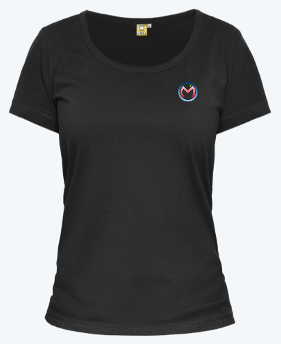

English | [简体中文](./ecosystem.cn.md) | [한국어](./ecosystem.kr.md)

## Ecosystem of Tencent Omi Web Framework has been released.

Omi 4.0 has received a lot of opinions and suggestions, as well as real PR. Although Omi is now accepted as a foreign friend, but with the gradual disappearance of the market share of IE, can meet the future, the Chinese people will embrace Omi. After a week of hard work, Omi Team has finally completed the core ecological construction to serve a large number of developers, of course, this is only a starting point, welcome any needs to us [open issues](https://github.com/Tencent/omi/issues/new), we treat your issues with speed will surprise you. Here is a brief introduction to our work in the last week:

| **Project**                         | **Description**                           |
| ------------------------------- | ----------------------------------- |
| [omi-docs](https://github.com/Tencent/omi/blob/master/docs/main-concepts.md)| Omi official documents |
| [omi-devtools](https://github.com/f/omi-devtools)| Browser DevTools extension |
| [omi-cli](https://github.com/Tencent/omi/tree/master/packages/omi-cli)| Project scaffolding |
|[omi-i18n](https://github.com/i18next/omi-i18n)| Internationalization solution for omi.js using i18next ecosystem |
| [omi-transform](https://github.com/Tencent/omi/tree/master/packages/omi-transform)|Omi / [css3transform](https://tencent.github.io/omi/packages/omi-transform/css3transform/) integration. Made css3 transform super easy in your Omi project.|
| [omi-page](https://github.com/Tencent/omi/tree/master/packages/omi-page) |Tiny client-side router by [page](https://github.com/visionmedia/page.js)|
| [omi-tap](https://github.com/Tencent/omi/tree/master/packages/omi-tap)|Support tap event in your omi project|
| [omi-finger](https://github.com/Tencent/omi/tree/master/packages/omi-finger)|Support touch and gesture events in your Omi project.|
| [omi-mobx](https://github.com/Tencent/omi/tree/master/packages/omi-mobx)|Omi Mobx Adapter|
|[omi element ui(working)](https://github.com/Tencent/omi/tree/master/packages/omi-element-ui)|Omi version of element-ui|
|omi t-shirt| Printed Omi logo's t-shirt.|

## International Docs

We now have three language version development documents:

| **Language**    | **Getting Start**                       |**Main Concepts**  |
|  -----   |  -----                    | -----   |
| English        | [English](https://github.com/Tencent/omi/blob/master/README.md)             |[English](https://github.com/Tencent/omi/blob/master/docs/main-concepts.md)  |
| Chinese        | [简体中文](https://github.com/Tencent/omi/blob/master/README.CN.md)             |[简体中文](https://github.com/Tencent/omi/blob/master/docs/main-concepts.cn.md)  |
| Korean        | [한국어](https://github.com/Tencent/omi/blob/master/README.KR.md)                     |[한국어](https://github.com/Tencent/omi/blob/master/docs/main-concepts.kr.md)  |

Turkey version and Japanese version of the relevant documents are also urgently needed to make up.

## Developer Tools

Using [Omi DevTools](https://chrome.google.com/webstore/detail/omijs-devtools/pjgglfliglbhpcpalbpeloghnbceocmd) you can simply debug and manage your UI **without any configuration**. Just install and debug.

Since Omi uses Web Components and Shadow-DOM, it doesn't need to have another elements panel such as React or Vue has. It just adds a panel to the **Elements' sidebar** and it's powerful as much as React and Vue DevTools.


The tool is create by [F](https://github.com/f).

## omi-cli

### Install

```bash
$ npm i omi-cli -g               # install cli
$ omi init your_project_name     # init project, you can also exec 'omi init' in an empty folder
$ cd your_project_name           # please ignore this command if you executed 'omi init' in an empty folder
$ npm start                      # develop
$ npm run build                  # release
```

Directory description:

```
├─ config
├─ public
├─ scripts
├─ src
│  ├─ assets
│  ├─ elements    //Store all custom elements
│  ├─ store       //Store all this store of pages
│  ├─ admin.js    //Entry js of compiler，will build to admin.html
│  └─ index.js    //Entry js of compiler，will build to index.html
```

About compiled website URL：

* [build env doc](https://facebook.github.io/create-react-app/docs/adding-custom-environment-variables#referencing-environment-variables-in-the-html)
* [build problem](https://stackoverflow.com/questions/42686149/create-react-app-build-with-public-url)

Such as in windows:

```json
"scripts": {
  "start": "node scripts/start.js",
  "_build": "node scripts/build.js",
  "build":"set PUBLIC_URL=https://fe.wxpay.oa.com/dv&& npm run _build"
}
```

TypeScript Template(omi-cli v3.0.3+):

```bash
$ npm i omi-cli -g                  # install cli
$ omi init-ts your_project_name     # init project, you can also exec 'omi init-ts' in an empty folder
$ cd your_project_name              # please ignore this command if you executed 'omi init' in an empty folder
$ npm start                         # develop
$ npm run build                     # release
```

CLI's auto-created project scaffolding is based on a single-page create-react-app to be converted into a multi-page one, with configuration issues to see [create-react-app user guide](https://facebook.github.io/create-react-app/docs/getting-started)

## omi-i18n

You can develop international Omi projects through `omi-i18n`.

```js
import { tag, WeElement } from "omi";
import { t } from "omi-i18n";

const catalog = {
  welcome: "Welcome to {{name}} using omi-i18n"
};

@tag("my-app")
class MyApp extends WeElement {
  render(props, data) {
    return (
      <i18n-provider locale="en" catalog={catalog}>
        <p slot="loading">
          <spinner-element />
        </p>
        <h1 class="app-title">{t("welcome", { name: data.name })}</h1>
      </i18n-provider>
    );
  }
}
```

## omi-transform

If you've ever used [css3transform](https://tencent.github.io/omi/packages/omi-transform/css3transform/), you know how pleasant it is to make pages. Now, you can also use the excellent features of CSS3 transform in Omi projects and have the same efficient performance:

```js
import { render, WeElement, define } from "omi";
import "omi-transform";

define("my-app", class extends WeElement {
  install() {
    this.data.rotateZ = 30
    this.linkRef = (e) => {
      this.animDiv = e
    }
  }


  installed() {
    setInterval(() => {
      // Slow: update -> render -> diff -> apply diff
      // this.data.rotateZ += 2

      // Fast，Because direct operation of DOM
      this.animDiv.rotateZ += 2
      // Synchronize transform to data to prevent any update
      this.data.rotateZ = this.animDiv.rotateZ
    }, 16)


  }
  render(props, data) {
    return (
      <css3-transform rotateZ={data.rotateZ} translateX={0} perspective={0} >
        <div ref={this.linkRef}>
          omi-transform
          </div>
      </css3-transform>
    )
  }
})

render(<my-app />, "body");
```

You can manipulate DOM directly to achieve high performance with the simple tips shown above and also be able to handle any form of component updates without losing state.

## omi-page

 Tiny size omi router by [page.js](https://github.com/visionmedia/page.js)
 
[→ demo](https://tencent.github.io/omi/packages/omi-page/examples/simple/)

usage:

```js
import { render, define, WeElement } from 'omi'
import page from 'omi-page'

define('my-app', class extends WeElement {
    installed() {
        page('/', this.index)
        page('/about', this.about)
        page('/contact', this.contact)
        page('/contact/:contactName', this.contact)
        page('*', this.notfound)
        page()
    }

    render() {
        return (
            <div>
                <ul>
                    <li><a href="/">/</a></li>
                    <li><a href="/about">/about</a></li>
                    <li><a href="/contact">/contact</a></li>
                    <li><a href="/contact/me">/contact/me</a></li>
                    <li><a href="/contact/me?a=b">/contact/me?a=b</a></li>
                    <li><a href="/not-found?foo=bar">/not-found</a></li>
                </ul>
                <p>
                    {this.data.path}
                </p>
            </div>
        )
    }

    index = (ctx) => {
        this.data.path = ctx.path
        this.update()
    }

    about = (ctx) => {
        this.data.path = ctx.path
        this.update()
    }

    contact = (ctx) => {
        this.data.path = ctx.path
        this.update()
    }

    notfound = (ctx) => {
        this.data.path = ctx.path
        this.update()
    }
})

render(<my-app></my-app>, 'body')
```

If you know express, page.js is completely inspired by express. Knowing express, you will definitely be able to get started with omi-page quickly.

## omi-tap

Omi can develop not only PC sites, but also Web pages called H5 pages that we use to develop Wechat and mobile QQ. Therefore, omi-tap binding tap event is provided to solve the problem of mobile click 300ms delay, and it is very easy to use:


```js
import { render, WeElement, define } from "omi"
import "omi-tap"

define("my-app", class extends WeElement {
  onTap = () => {
    console.log('tap')
  }

  render() {
    return (
      <omi-tap onTap={this.onTap} >
        <div>Tap Me!</div>
      </omi-tap>
    )
  }
})

render(<my-app />, "body");
```

## omi-finger

For mobile terminal, responsible gesture interaction, we also provide omi-finger gesture interaction library. You can open the page on the mobile side to see omi-finger's ability:

[→ omi-finger demo](http://alloyteam.github.io/AlloyFinger/)

usage:

```js
import { render, define, WeElement } from 'omi'
import 'omi-finger'

define('my-app', class extends WeElement {
  static observe = true

  install() {
    this.data.wording = 'Tap or Swipe Me!'
  }

  handleTap = (evt) => {
    this.data.wording += '\r\nTap'
  }

  handleSwipe = (evt) => {
    this.data.wording += '\r\nSwipe-' + evt.direction
  }

  render() {
    return (
      <div>
        <omi-finger onTap={this.handleTap} abc={{a:1}} onSwipe={this.handleSwipe}>
          <div class="touchArea" >
            {this.data.wording}
          </div>
        </omi-finger>
      </div>
    )
  }
}

render(<my-app></my-app>, 'body')
```

Support gesture list:

| **Gesture**    | 
| -----  | 
| onTap  | 
| onMultipointStart   | 
| onLongTap | 
| onSwipe   | 
| onPinch  | 
| onRotate   | 
| onPressMove   | 
| onMultipointEnd    | 
| onDoubleTap | 

## omi-mobx

Omi's built-in observation is implemented through proxy. If you want to be IE11-compatible, you can use omi-mobx to implement a responsive view:

```js
import { tag, WeElement } from "omi"
import { observe } from "omi-mobx"

@observe
@tag("my-app")
class MyApp extends WeElement {
  install() {
    this.data.name = "omi"
  }

  onClick = () => {
    this.data.name = "Omi V4.0"
  }

  render(props, data) {
    return (
      <div onClick={this.onClick}>
        <h1>Welcome to {data.name}</h1>
      </div>
    )
  }
}
```

## omi-element-ui

Omi version of element-ui, Omi version of weui and antd are also in progress, look forward to it.

[→ Join in](https://github.com/Tencent/omi/tree/master/packages/omi-element-ui)。

## omi t-shirt




## Thanks

Thank you very much for contributing to the Omi ecosystem.

* [F](https://github.com/f)
* [LeeHyungGeun ](https://github.com/LeeHyungGeun)
* [validalias ](https://github.com/validalias)
* [xcatliu](https://github.com/xcatliu)
* [vorshen](https://github.com/vorshen)
* [uxu](https://github.com/pasturn)
* [ghostzhang](https://github.com/ghostzhang)
* [zhengbao](https://github.com/zhengbao)
* [1921622004](https://github.com/1921622004)
* [wadellg](https://github.com/wadellg)
* [benjamingr](https://github.com/benjamingr)
* [dntzhang](https://github.com/dntzhang)

And others who are contributing to Omi...

We will also hold the [Omi Conf](https://github.com/Tencent/omi/issues/62) at the end of this year , with tickets free of charge, or roughly equal to free, to filter out invalid applicants.

[→ Hug Web Components now， Join Omi](https://github.com/Tencent/omi)
