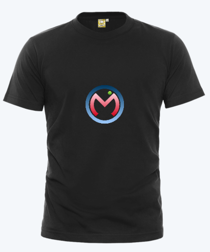
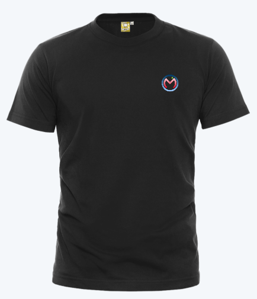
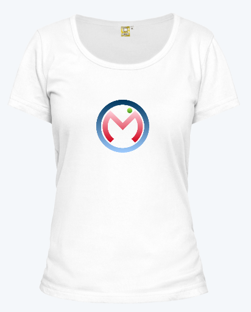

## 腾讯发布 Omi 生态

Omi 4.0 发布至今，收到了大量的意见和建议以及真刀真枪的 PR，虽然现在接受 Omi 都是外国友人，但是随着 IE 市场份额的慢慢消失，可以遇见的未来，国人也会慢慢拥抱 Omi。Omi Team 经过一个星期的努力，终于完成了核心的生态的构建服务与海量的开发者，当然这只是一个起点，欢迎有任何需求给我们[开 Issues](https://github.com/Tencent/omi/issues/new), 我们对待你提的 issues 处理的速度会令你感到惊讶。 下面郑重介绍下最近一个星期我们的工作:


| **项目**                         | **描述**                           |
| ------------------------------- | ----------------------------------- |
| [omi-docs](https://github.com/Tencent/omi/blob/master/docs/main-concepts.cn.md)| Omi 官方文档 |
| [omi-devtools](https://github.com/f/omi-devtools)| 谷歌浏览器开发工具扩展|
| [omi-cli](https://github.com/Tencent/omi/tree/master/packages/omi-cli)| 项目脚手架工具，支持 Javascript 和 Typescript |
|[omi-i18n](https://github.com/i18next/omi-i18n)| Omi 国际化解决方案 |
| [omi-transform](https://github.com/Tencent/omi/tree/master/packages/omi-transform)|Omi 和 [css3transform](https://tencent.github.io/omi/packages/omi-transform/css3transform/) 完美结合. 让 css3 transform 在你的 Omi项目中变得超级简单.|
| [omi-page](https://github.com/Tencent/omi/tree/master/packages/omi-page) | 基于 [page.js](https://github.com/visionmedia/page.js) 的 Omi 路由|
| [omi-tap](https://github.com/Tencent/omi/tree/master/packages/omi-tap)| 让 Omi 项目轻松支持 tap 事件|
| [omi-finger](https://github.com/Tencent/omi/tree/master/packages/omi-finger)|Omi 官方手势库|
| [omi-mobx](https://github.com/Tencent/omi/tree/master/packages/omi-mobx)|Omi Mobx 适配器|
|[omi element ui(working)](https://github.com/Tencent/omi/tree/master/packages/omi-element-ui)|Omi 版本的 element-ui|
|[westore](https://github.com/dntzhang/westore)|小程序解决方案 westore，与 Omi 互相启发|
|omi 周边|T恤、衣服、手机壳、包包等|
## 文档国际化

我们现在拥有了三个语言版本的开发文档:

| **语言**    | **快速入门**                       |**主要概念**  |
| 英语        | [English](https://github.com/Tencent/omi/blob/master/README.md)             |[English](https://github.com/Tencent/omi/blob/master/docs/main-concepts.md)  |
| 中文        | [简体中文](https://github.com/Tencent/omi/blob/master/README.CN.md)             |[简体中文](https://github.com/Tencent/omi/blob/master/docs/main-concepts.cn.md)  |
| 韩文        | [한국어](https://github.com/Tencent/omi/blob/master/README.KR.md)                     |[한국어](https://github.com/Tencent/omi/blob/master/docs/main-concepts.kr.md)  |

土耳其版本和日语版本的相关文档也正在紧急补齐当中。

## 开发者工具

使用 Omi 开发工具 可以非常简单地调试和管理你的 UI。不需要任何配置，你只要安装然后就能调试。

既然 Omi 使用了 Web Components 和 Shadow-DOM, 所以不需要像 React 和 Vue 一样安装其他元素面板，只需要使用 Chrome 自带的 Elements' sidebar 便可，它和 React and Vue 开发者工具一样强大。


工具由于[土耳其大神 F](https://github.com/f) 亲自操刀打造。你可以 [从 Chrome 应用商店安装](https://chrome.google.com/webstore/detail/omijs-devtools/pjgglfliglbhpcpalbpeloghnbceocmd/related)。

## omi-cli

### 安装

```bash
$ npm i omi-cli -g               # install cli
$ omi init your_project_name     # init project, you can also exec 'omi init' in an empty folder
$ cd your_project_name           # please ignore this command if you executed 'omi init' in an empty folder
$ npm start                      # develop
$ npm run build                  # release
```

目录说明:

```
├─ config
├─ public
├─ scripts
├─ src
│  ├─ assets
│  ├─ elements    //存放所有 custom elements
│  ├─ store       //存放所有页面的 store
│  ├─ admin.js    //入口文件，会 build 成  admin.html
│  └─ index.js    //入口文件，会 build 成  index.html
```

使用 TypeScript 模板(omi-cli v3.0.3+):

```bash
$ npm i omi-cli -g                  # install cli
$ omi init-ts your_project_name     # init project, you can also exec 'omi init-ts' in an empty folder
$ cd your_project_name              # please ignore this command if you executed 'omi init' in an empty folder
$ npm start                         # develop
$ npm run build                     # release
```

Cli 自动创建的项目脚手架是基于单页的 create-react-app 改造成多页的，有配置方面的问题可以查看 [create-react-app 用户指南](https://github.com/facebook/create-react-app/blob/master/packages/react-scripts/template/README.md)。

感谢 [xcatliu](https://github.com/xcatliu) 和 [uxu](https://github.com/pasturn) 为 omi-cli 做出的贡献。

## omi-i18n

你可以通过 `omi-i18n` 开速开发国际化的 Omi 项目:

```js
import { tag, WeElement } from "omi";
import { t } from "omi-i18n";

const catalog = {
  welcome: "Welcome to {{name}} using omi-i18n"
};

@tag("my-app")
class MyApp extends WeElement {
  render(props, data) {
    return (
      <i18n-provider locale="en" catalog={catalog}>
        <p slot="loading">
          <spinner-element />
        </p>
        <h1 class="app-title">{t("welcome", { name: data.name })}</h1>
      </i18n-provider>
    );
  }
}
```

## omi-transform

如果你使用过 [css3transform](https://tencent.github.io/omi/packages/omi-transform/css3transform/), 就知道制作页面动效是多么地惬意。现在，你再 Omi 项目里也可以使用上 css3transform 的优秀的特性并且拥有同样高效的性能:

```js
import { render, WeElement, tag, observe } from "omi";
import "omi-transform";

@observe
@tag("my-app")
class MyApp extends WeElement {
  install() {
    this.data.rotateZ = 30
    this.linkRef = (e) => {
      this.animDiv = e
    }
  }


  installed() {
    setInterval(() => {
      // 慢，因为直接改变 data 会触发 update -> render -> diff -> apply diff
      // this.data.rotateZ += 2

      //快，因为直接操作 dom
      this.animDiv.rotateZ += 2
      //同步 transform 给 data 防止任何 update
      this.data.rotateZ = this.animDiv.rotateZ
    }, 16)


  }
  render(props, data) {
    return (
      <css3-transform rotateZ={data.rotateZ} translateX={0} perspective={0} >
        <div ref={this.linkRef}>
          omi-transform
          </div>
      </css3-transform>
    )
  }
}

render(<my-app />, "body");
```

你可以通过上面展示的简单小技巧直接操作 DOM 获取高效的运动性能并且也能应对任何形式的组件更新而不丢失状态。

## omi-page

 基于 [page.js](https://github.com/visionmedia/page.js) 的 Omi 路由。
 
[→ demo](https://tencent.github.io/omi/packages/omi-page/examples/simple/)

使用:

```js
import { render, tag, WeElement } from 'omi'
import page from 'omi-page'

@tag('my-app')
class MyApp extends WeElement {
    installed() {
        page('/', this.index)
        page('/about', this.about)
        page('/contact', this.contact)
        page('/contact/:contactName', this.contact)
        page('*', this.notfound)
        page()
    }

    render() {
        return (
            <div>
                <ul>
                    <li><a href="/">/</a></li>
                    <li><a href="/about">/about</a></li>
                    <li><a href="/contact">/contact</a></li>
                    <li><a href="/contact/me">/contact/me</a></li>
                    <li><a href="/contact/me?a=b">/contact/me?a=b</a></li>
                    <li><a href="/not-found?foo=bar">/not-found</a></li>
                </ul>
                <p>
                    {this.data.path}
                </p>
            </div>
        )
    }

    index = (ctx) => {
        this.data.path = ctx.path
        this.update()
    }

    about = (ctx) => {
        this.data.path = ctx.path
        this.update()
    }

    contact = (ctx) => {
        this.data.path = ctx.path
        this.update()
    }

    notfound = (ctx) => {
        this.data.path = ctx.path
        this.update()
    }
}

render(<my-app></my-app>, 'body')
```

如果你知道 express，page.js 完全受 express 启发。了解 express 你就肯定能够快速上手 omi-page。

## omi-tap

Omi 不仅可以开发 PC 网站，我们拿来开发微信和手机 QQ 的 Web 页面，也叫 H5 页面。所以提供了 omi-tap 绑定 tap 事件来解决移动端 click 300ms 延迟的问题，使用方式也是极其简便：


```js
import { render, WeElement, tag } from "omi"
import "omi-tap"

@tag("my-app")
class MyApp extends WeElement {
  onTap = () => {
    console.log('tap')
  }

  render() {
    return (
      <omi-tap onTap={this.onTap} >
        <div>Tap Me!</div>
      </omi-tap>
    )
  }
}

render(<my-app />, "body");
```

## omi-finger

针对移动端，负责的手势交互，我们也提供了 omi-finger 手势交互库。你可以移动端打开这个页面看看 omi-finger 的能力:

[→ omi-finger demo](http://alloyteam.github.io/AlloyFinger/)

使用：


```js
import { render, tag, WeElement, observe } from 'omi'
import 'omi-finger'

@observe
@tag('my-app')
class MyApp extends WeElement {
  install() {
    this.data.wording = 'Tap or Swipe Me!'
  }

  handleTap = (evt) => {
    this.data.wording += '\r\nTap'
  }

  handleSwipe = (evt) => {
    this.data.wording += '\r\nSwipe-' + evt.direction
  }

  render() {
    return (
      <div>
        <omi-finger onTap={this.handleTap} abc={{a:1}} onSwipe={this.handleSwipe}>
          <div class="touchArea" >
            {this.data.wording}
          </div>
        </omi-finger>
      </div>
    )
  }
}

render(<my-app></my-app>, 'body')
```

支持手势列表:

| **手势**    | 
| -----  | 
| onTap  | 
| onMultipointStart   | 
| onLongTap | 
| onSwipe   | 
| onPinch  | 
| onRotate   | 
| onPressMove   | 
| onMultipointEnd    | 
| onDoubleTap | 

## omi-mobx

Omi 内置的 observe 是通过 proxy 实现的，如果你想要兼容 IE11, 你可以使用 omi-mobx 去实现响应式视图:

```js
import { tag, WeElement } from "omi"
import { observe } from "omi-mobx"

@observe
@tag("my-app")
class MyApp extends WeElement {
  install() {
    this.data.name = "omi"
  }

  onClick = () => {
    this.data.name = "Omi V4.0"
  }

  render(props, data) {
    return (
      <div onClick={this.onClick}>
        <h1>Welcome to {data.name}</h1>
      </div>
    )
  }
}
```

## omi-element-ui

Omi 版本的 element-ui, omi 版本的 weui 也在同步进行当中，期待一下。

你也可以[→ 加入进来](https://github.com/Tencent/omi/tree/master/packages/omi-element-ui)。

## omi 周边








## 感谢

非常感谢各位为 Omi 生态的贡献:

* [土耳其的大神 F](https://github.com/f)
* [韩国的 validalias ](https://github.com/validalias)
* [腾讯的 xcatliu](https://github.com/xcatliu)
* [腾讯的 vorshen](https://github.com/vorshen)
* [腾讯的 uxu](https://github.com/pasturn)
* [腾讯的 ghostzhang](https://github.com/ghostzhang)
* [腾讯的 zhengbao](https://github.com/zhengbao)
* [中国的 1921622004](https://github.com/1921622004)
* [以色列的 benjamingr](https://github.com/benjamingr)
* [还有我 dntzhang](https://github.com/dntzhang)

以及其他正在为 Omi 贡献的人....
 
 我们也会在今年年底举办 [Omi Conf 开发者大会](https://github.com/Tencent/omi/issues/62)，门票大概率免费，或者约等于免费用来过滤无效报名者。

[→ 立刻拥抱 Web Components ，加入 Omi](https://github.com/Tencent/omi)