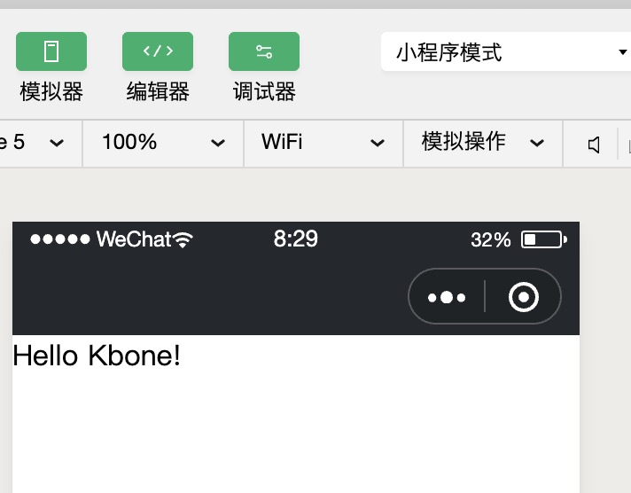
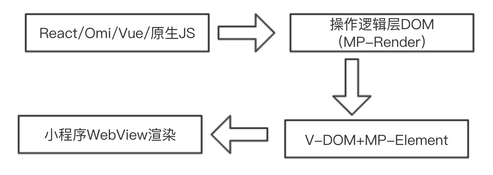
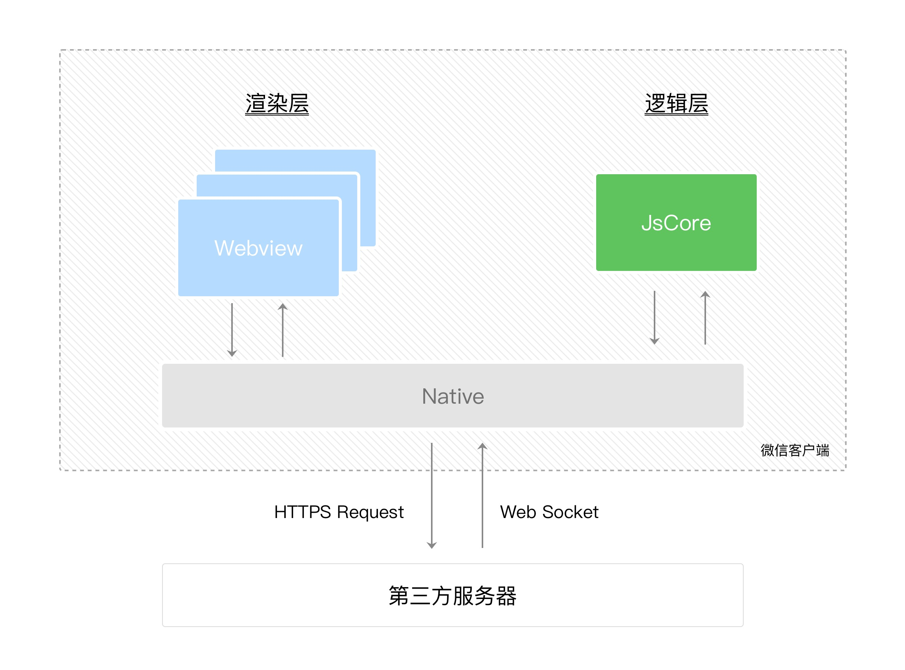

## 多端统一框架 kbone 深度体验 - 支持 Omi、React、Vue 和原生JS

kbone 是小程序官方出的多端统一框架，市面上就很多跨端开发框架，但是 kbone 是最彻底的一款。因为:

> kbone 不仅可以开发小程序和 Web，而且可以使用**任意前端框架**开发小程序和 Web。

* [omi-kbone](https://github.com/Tencent/omi/tree/master/packages/omi-kbone)
* [vue-kbone](https://github.com/wechat-miniprogram/kbone)
* [react-kbone](https://github.com/Tencent/omi/tree/master/packages/react-kbone)

阅读本文你可以收获：

* Kbone 基础原理
* 领域驱动设计在前端的集成
* 理解 MVC、MVP、MVVM 模式
* 使用 DOM 编写小程序游戏（并非小游戏）
* 游戏主帧率和局部帧率控制

## Kbone 基础原理

打开 Kbone 官方编译出的小程序的 index.js，修改其中的代码：

```js
const mp = require('miniprogram-render')
const config = require('../../config')

function init(window, document) {
    require('../../common/vendors~index.js')(window, document);

    const ele = document.createElement('div')
    ele.innerHTML = 'Hello Kbone!'
    document.body.appendChild(ele)
}
...
```

运行效果如下:




上面的代码运行在小程序里。可以窥见其一二：

* Kbone 实现了完整的 DOM/BOM 对象模型，即官方的 miniprogram-render
* Kbone 允许 react、omi 和 vue 的完整 runtime 嵌入在小程序中

还有看不见的，比如：

* Kbone 利用自定义组件渲染所有 DOM 节点
* 自定义组件可以自引用来描述完整 DOM 树

该自定义组件就是官方封装的 miniprogram-element：

```json
{
  "usingComponents": {
		"element": "miniprogram-element"
	}
}
```

```html
<element data-private-node-id="{{nodeId}}" data-private-page-id="{{pageId}}"></element>
````

pageId 和 nodeId 两个参数缺一不可，组件内部会根据传入的 pageId 找到对应的 window/document，然后根据 nodeId 找到对应的 dom 节点进行渲染。
上面说了，miniprogram-render 实现了轻量的 DOM 对象模型，所以不管是框架还是原生js执行之后，输出一些节点信息，也算是虚拟 DOM，比如嵌套的 childNodes。miniprogram-element 可以根据节点信息作为自定义组件的 data，并且遍历生产 WXML 组件的节点树。



其中 v-dom 相当于数据， mp-element 相当于模板，数据+模板完成渲染。其中前面三个步骤都是运行在小程序逻辑层(JSCore)当中，使用逻辑层自己模拟出来的 DOM/BOM API，也就是官方的 miniprogram-render。



## 实战 TodoApp

[→ TodoApp 源码](https://github.com/Tencent/omi/tree/master/packages/omi-kbone)

## 实战贪吃蛇


[→ 贪吃蛇源码](https://github.com/Tencent/omi/tree/master/packages/omi-kbone)


## 谁在使用 kbone？

<table>
	<tbody>
		<tr>
			<td><a target="_blank" href="https://developers.weixin.qq.com/community/develop/mixflow"></a></td>
			<td><a target="_blank" href="http://omijs.org"></a></td>
			<td width="92px"><a target="_blank" href="https://github.com/Tencent/omi/issues/new">告诉我们</a></td>
		
</table>

## 注意事项

* 不要使用 bindtap，使用 onClick
* 图片请使用 cdn 地址或者 base64
* 如果要兼容 web，请用 HTML 和 CSS 标签，比如用 div，不用 view，不用 rpx 单位等


未完待续..