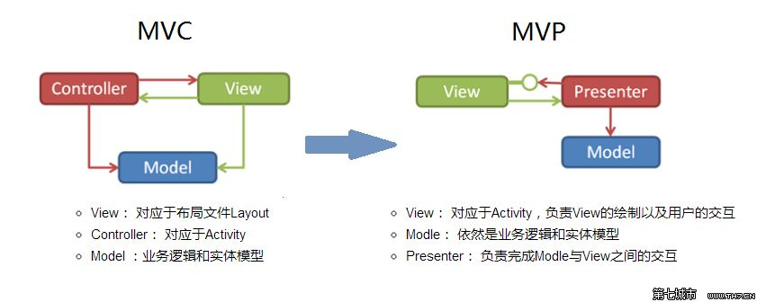

## Omi 5.0 发布 - Web 前端 MVVM 王者归来

<p align="center"></p>

* [→ All the source code](https://github.com/Tencent/omi/tree/master/packages/omi/examples/mvvm)
* [→ Online Demo](https://tencent.github.io/omi/packages/omi/examples/mvvm/)

### 写在前面

Omi 正式发布 5.0，依然专注于 View，但是对 MVVM 架构更加友好的集成，彻底分离视图与业务逻辑的架构。


你可以通过 omi-cli 快速体验 MVVM:

```bash
$ npm i omi-cli -g        
$ omi init-mvvm my-app    
$ cd my-app         
$ npm start                   
$ npm run build             
```

> `npx omi-cli init-mvvm my-app` 也支持(要求 npm v5.2.0+)

其他模板：

| **Template Type**|  **Command**|  **Describe**|
| ------------ |  -----------|  ----------------- |
|Base Template|`omi init my-app`| 基础模板|
|TypeScript Template(omi-cli v3.0.5+)|`omi init-ts my-app`|使用 TypeScript 的模板|
|[SPA Template](https://tencent.github.io/omi/packages/omi-router/examples/spa/build/)(omi-cli v3.0.10+)|`omi init-spa my-app`|使用  omi-router 单页应用的模板|
|omi-mp Template(omi-cli v3.0.13+)|`omi init-mp my-app`  |小程序开发 Web 的模板|

### MVVM 演化

MVVM 其实本质是由 MVC、MVP 演化而来。



目的都是分离视图和模型，但是在 MVC 中，视图依赖模型，耦合度太高，导致视图的可移植性大大降低，在 MVP 模式中，视图不直接依赖模型，由 P(Presenter)负责完成 Model 和 View 的交互。MVVM 和 MVP 的模式比较接近。ViewModel 担任这 Presenter 的角色，并且提供 UI 视图所需要的数据源，而不是直接让 View 使用 Model 的数据源，这样大大提高了 View 和 Model 的可移植性，比如同样的 Model 切换使用 Flash、HTML、WPF 渲染，比如同样 View 使用不同的 Model，只要 Model 和 ViewModel 映射好，View 可以改动很小甚至不用改变。

### Mappingjs

当然 MVVM 这里会出现一个问题, Model 里的数据映射到 ViewModel 提供该视图绑定，怎么映射？手动映射？自动映射？在 ASP.NET MVC 中，有强大的 [AutoMapper](https://www.c-sharpcorner.com/UploadFile/tirthacs/using-automapper-in-mvc/) 用来映射。针对 JS 环境，我特地封装了 [mappingjs](https://github.com/Tencent/omi/tree/master/packages/mappingjs) 用来映射 Model 到 ViewModel。


你可以通后 npm 安装使用:

```js
npm i mappingjs
```


#### 使用方式

```js
var a = { a: 1 }
var b = { b: 2 }

deepEqual(mapping({
  from: a,
  to: b
}), { a: 1, b: 2 })
```

#### 自动 Mapping

```js
class TodoItem {
  constructor(text, completed) {
    this.text = text
    this.completed = completed || false

    this.author = {
      firstName: 'dnt',
      lastName: 'zhang'
    }
  }
}

const res = mapping.auto(new TodoItem('task'))

deepEqual(res, {
  author: {
    firstName: "dnt",
    lastName: "zhang"
  },
  completed: false,
  text: "task"
})
```

带有初始值`{ author: { a: 1 } }`的自动映射:

```js
const res = mapping.auto(new TodoItem('task'), { author: { a: 1 } })

deepEqual(res, {
  author: {
    firstName: "dnt",
    lastName: "zhang",
    a: 1
  },
  completed: false,
  text: "task"
})
```

### Omi MVVM Todo 实战

定义 TodoItem Model:

```js
let id = 0

export default class TodoItem {
  constructor(text, completed) {
    this.id = id++
    this.text = text
    this.completed = completed || false

    this.author = {
      firstName: 'dnt',
      lastName: 'zhang'
    }
  }
}
```

定义 Todo Model:

```js
import TodoItem from './todo-item'
import { getAll, add } from './todo-server'

export default class Todo {
  constructor() {
    this.items = []

    this.author = {
      firstName: 'dnt',
      lastName: 'zhang'
    }
  }

  initItems(list) {
    list.forEach(item => {
      this.items.push(new TodoItem(item.text))
    })
  }

  add(content) {
    const item = new TodoItem(content)
    this.items.push(item)
    add(item)
  }

  updateContent(id, content) {
    this.items.every(item => {
      if (id === item.id) {
        item.content = content
        return false
      }
    })
  }

  complete(id) {
    this.items.every(item => {
      if (id === item.id) {
        item.completed = true
        return false
      }
      return true
    })
  }

  uncomplete(id) {
    this.items.every(item => {
      if (id === item.id) {
        item.completed = false
        return false
      }
      return true
    })
  }

  remove(id) {
    this.items.every((item, index) => {
      if (id === item.id) {
        this.items.splice(index, 1)
        return false
      }
    })
  }

  clear() {
    this.items.length = 0
  }

  getAll(callback) {
    getAll(list => {
      this.initItems(list)
      callback()
    })
  }
}
```

定义 ViewModel:

```js
import mapping from 'mappingjs'
import shared from './shared'
import todoModel from '../model/todo'
import ovm from './other'

class TodoViewModel {
  constructor() {
    this.data = {
      items: []
    }
  }

  update(todo) {
    //这里进行自动映射，一行代码轻松搞定 
    mapping.auto(todo, this.data)
    this.data.projName = shared.projName
  }

  add(text) {
    todoModel.add(text)
    this.update(todoModel)
    ovm.update()
  }
  
  getAll() {
    todoModel.getAll(() => {
      this.update(todoModel)
      ovm.update()
    })
  }

  changeSharedData() {
    shared.projName = 'I love omi-mvvm.'
    ovm.update()
    this.update()
  }
}

const vd = new TodoViewModel()

export default vd
```

* vm 只专注于 update 数据，视图会自动更新
* 公共的数据或 vm 可通过 import 依赖


定义 View， 注意下面是继承自 ModelView 而非 WeElement。

```js
import { ModelView, define } from 'omi'
import vm from '../view-model/todo'
import './todo-list'
import './other-view'

define('todo-app', class extends ModelView {
  vm = vm

  onClick = () => {
    //view model 发送指令
    vm.changeSharedData()
  }

  install() {
    //view model 发送指令
    vm.getAll()
  }

  render(props, data) {
    return (
      <div>
        TODO by <span>by {data.author.firstName + data.author.lastName}</span>
        <todo-list items={data.items} />
        <form onSubmit={this.handleSubmit}>
          <input onChange={this.handleChange} value={this.text} />
          <button>Add #{data.items.length + 1}</button>
        </form>
        <div>{data.projName}</div>
        <button onClick={this.onClick}>Change Shared Data</button>
        <other-view />
      </div>
    )
  }

  handleChange = e => {
    this.text = e.target.value
  }

  handleSubmit = e => {
    e.preventDefault()
    if(this.text !== ''){
      //view model 发送指令
      vm.add(this.text)
      this.text = ''
    }
  }
})
```

* 所有数据通过 vm 注入
* 所以指令通过 vm 发出


定义 TodoList View:

```js
import { define, WeElement } from 'omi'
import vm from '../view-model/todo'

define('todo-list', class extends WeElement {
  css() {
    return `
    .completed{
      color: #d9d9d9;
      text-decoration: line-through;
    }
   `
  }

  onChange = (evt, id) => {
    if (evt.target.checked) {
      vm.complete(id)
    } else {
      vm.uncomplete(id)
    }
  }

  render(props) {
    return (
      <ul>
        {props.items.map(item => (
          <li class={item.completed && 'completed'}>
            <input
              type="checkbox"
              onChange={evt => {
                this.onChange(evt, item.id)
              }}
            />
            {item.text}
          </li>
        ))}
      </ul>
    )
  }
})
```

需要特别强调的是，当你从数组中移除的时候，需要先清空数组：

```js
remove(id) {
  todo.remove(id)
  //empty first
  this.data.items.length = 0
  mapping.auto(todo, this.data)
}
```

[→ 完整代码戳这里](https://github.com/Tencent/omi/tree/master/packages/omi-cli/template/mvvm/src)


### 小结

从宏观的角度来看，Omi 的 MVVM 架构也属性网状架构，网状架构目前来看有:

* Mobx + React
* Hooks + React
* MVVM (Omi) 

大势所趋！简直是前端工程化最佳实践！也可以理解成网状结构是描述和抽象世界的最佳途径。那么网在哪？

* ViewModel 与 ViewModel 之间相互依赖甚至循环依赖的网状结构
* ViewModel 一对一、多对一、一对多、多对多依赖 Models 形成网状结构
* Model 与 Model 之间形成相互依赖甚至循环依赖的网状结构
* View 一对一依赖 ViewModel 形成网状结构

总结如下：

|| Model| ViewModel|View|
|---|----|----|-----|
|Model|多对多|多对多|无关联|
|ViewModel|多对多|多对多|一对一|
|View|无关联|一对一|多对多|


## Star & Fork

* [https://github.com/Tencent/omi](https://github.com/Tencent/omi)
