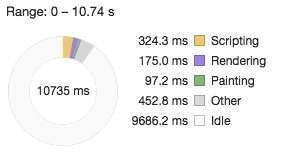

## 프롤로그

[Omi 프레임워크](https://github.com/Tencent/omi/) 정식 배포 [→ omi-transform](https://github.com/Tencent/omi/tree/master/packages/omi-transform).

> Made css3 transform super easy.


Omi Transform 은 특수 모션 솔루션으로 Omi 프로젝트에서 CSS Transform 설정을 쉽고 빠르게 할 수 있습니다. 먼저 css3transform에 대해 말하자면, css3transform은 모바일 웹 솔루션으로 위챗 과 QQ 모바일 버전에 광대하게 사용되고 있습니다. 또한 근본적인 DOM 애트리뷰트 **수정**을위해 편리한 기능들을 제공합니다.

[css3transform 공식 홈페이지](https://tencent.github.io/omi/packages/omi-transform/css3transform/) 를 통해 빠르게 확인할 수 있습니다.

공식 웹사이트의 예는 Native JS를 사용한 예이고이고 css3transform의 React 버전도 있습니다. 그래서 React 의 선언전 프로그래밍 방식으로도 css3transform 을 사용할 수 있습니다:

``` js
render() {
    return (
        <Transform
          translateX={100}
          scaleX={0.5}
          originX={0.5}>
          <div>Transform DOM</div>
        </Transform>
    );
}
```

중요한 부분은 omi-transform 입니다.

## omi-transform 3분 마스터

### NPM Install

``` js
npm install omi-transform
```

### Usage


```js
import { render, WeElement, define } from "omi"
import "omi-transform"

define("my-app", class extends WeElement {
  install() {
    this.data.rotateZ = 30
    this.linkRef = (e) => {
      this.animDiv = e
    }
  }

  installed() {
    setInterval(() => {
      //slow
      // this.data.rotateZ += 2
      // this.update()

      //fast
      this.animDiv.rotateZ += 2
      //sync for update call of any scenario
      this.data.rotateZ = this.animDiv.rotateZ
    }, 16)
  }

  render(props, data) {
    return (
      <css3-transform rotateZ={data.rotateZ} translateX={0} perspective={0} >
        <div ref={this.linkRef}>
          omi-transform
        </div>
      </css3-transform>
    )
  }
})

render(<my-app />, "body")
```

* DOM을 직접 조작하기위해 css3transform을 사용하는 DOM 에 `ref` 표시합니다.
* this.refs.xxx 를 사용하여 구성 요소 기능에서 css transform 등록 정보를 읽거나 설정할 수 있습니다
* this.refs.xxx 는 "translateX", "translateY", "translateZ", "scaleX", "scaleY", "scaleZ", "rotateX", "rotateY", "rotateZ", "skewX", "skewY", "originX", "originY", "originZ", "perspective" 를 지원하며. 이러한 속성은 설정되고 읽기가 가능합니다.
* perspective 표시가 없으면 기본적으로 투영은 사용되지 않습니다.

컴포넌트의 DOM은 기타 로직의 변경때문에 업데이트 될것입니다. 아마 User Interaction 혹은 데이터 반환을 위한 콜백일 수 있습니다. 따라서 업데이트 전후에 DOM 상태를 유지하는 것이 매우 중요합니다. 그렇지 않으면 깜빡임, 혹은 기타 디스플레이 관련 로직 오류가 발생할 것입니다.

위 코드가 DOM 동작 중에 Diff 를 수행하지 않는다는 것을 볼수 있습니다. 즉, 구성 요소가 업데이트 되지 않습니다. 이 의미는 구성 요소를 업데이트 할때 모든 모션의 상태가 유실된다는 것입니다. Omi 는 이 문제를 어떻게 해결할 까요?

> `this.data.rotateZ`를 사용하여 DOM 모션의 상태를 동기화 하여 우발적인 새로고침(`update`)를 방지합니다.

[→ 데모](https://tencent.github.io/omi/packages/omi/examples/css3transform/)

## 지원 프로퍼티

| **Property**    | **Describe**                           |
| --------- | ---------------------- |
| translateX |translateX |
| translateY |translateY |
| translateZ |translateZ |
| scaleX |scaleX |
| scaleY |scaleY |
| scaleZ |scaleZ|
| rotateX |rotateX |
| rotateY |rotateY |
| rotateZ |rotateZ |
| skewX | skewX|
| skewY |skewY |
| originX |  the basic x point of rotation|
| originY | the basic y point of rotation |
| originZ |  the basic z point of rotation|
| perspective |Perspective projection distance |

get 과 set 사용 가능.

## 성능 비교

React 버전에는 diff 프로세스가 있고, diff 에 dom 프로세스를 적용하고, 상태 변경은 전체 innerHTML을 대체하지 않으므로 브라우저 렌더링은 여전히 저렴합니다. 하지만 JS 의 diff 프로세스는 여전히 Profiles 로 이동해야 합니다. 그래서 많은 시간이 걸리며 웹 워커에서 멈추지 않습니다. UI 스레드는 멈춤, 상호작용 지연등을 유발합니다. 따라서 CPU의 소비량을 살펴 보는 것이 필요합니다.

다음 데이터는 두 가지 방법으로 크롬 Profiles를 사용하여 omi-transform 과 react-transform 을 비교 합니다.

**총 소요 시간 비교**：

react-transform：


omi-transform：


- React 는 9739ms 내에 CPU를 대략 **1686ms** 소비합니다.
- Omi 는 9254ms 내에 CPU를 대략 **700ms** 소비합니다.

Profiles 이 없으면 State 가 React Lifecycle을 거치기 때문에 느려질 것이라고 생각 하지만 React에서 소요된 시간은 여전히 수용 가능할 정도이며 생각보다 느려지지 않습니다.

Omi 는 거의 전통적인 Native JS와 같습니다. DOM Diff 를 하지 않는다고 볼수 있을정도입니다!!!

## Omi 자기비교

```js
//slow
this.data.rotateZ += 2
this.update()
```

```js
//fast
this.animDiv.rotateZ += 2
this.data.rotateZ = this.animDiv.rotateZ
```

위의 두 코드 블록의 실행 효율성을 주로 비교해서 결과를 봐주세요:

| **Slow**                         | **Fast**                           |
| ------------------------------- | ----------------------------------- |
|  |  |

Omi 는 10초안의 긴 유효시간이 걸리는 두 가지 방식에서 모두 고성능인 것을 볼 수 있습니다. 그리고 Fast 방식은 확실히 더 빠르고, Scripting 의 소요시간은 더 적게 듭니다. 장점이 분명하지 않나요? 왜냐하면 DOM 조작 방식이 간단하기 때문입니다. 만약 DOM 조작 방식이 복잡하다면 Fast 방식은 직접 Slow 방식의 많은 부분을 제거할 것입니다!

## Star & Fork

[→ omi-transform](https://github.com/Tencent/omi/tree/master/packages/omi-transform)
